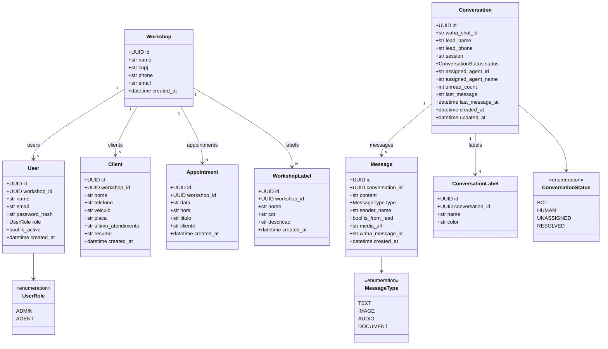
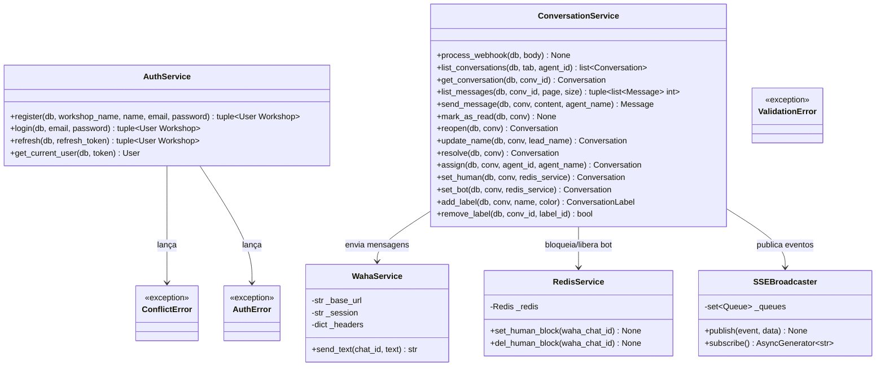
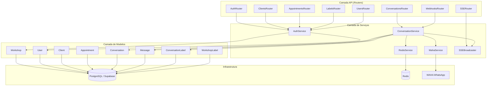

# Diagrama de Classes — Mecaflow

> Abra o preview do Markdown no VS Code (`Ctrl+Shift+V`) para visualizar o diagrama renderizado.

---

## Modelos ORM (SQLAlchemy)



---

## Schemas Pydantic (Entrada / Saída)

```mermaid
classDiagram
    direction LR

    class RegisterIn {
        +str workshop_name
        +str name
        +EmailStr email
        +str password
    }
    class LoginIn {
        +EmailStr email
        +str password
    }
    class RefreshIn {
        +str refresh_token
    }
    class TokenOut {
        +str access_token
        +str refresh_token
        +str token_type
        +UserOut user
        +WorkshopOut workshop
    }
    class UserOut {
        +UUID id
        +str name
        +str email
        +str role
        +UUID workshop_id
    }
    class WorkshopOut {
        +UUID id
        +str name
    }

    class ClientIn {
        +str nome
        +str telefone
        +str veiculo
        +str placa
        +str ultimo_atendimento
        +str resumo
    }
    class ClientOut {
        +UUID id
        +UUID workshop_id
        +datetime created_at
    }
    ClientOut --|> ClientIn

    class AppointmentIn {
        +str data
        +str hora
        +str titulo
        +str cliente
    }
    class AppointmentOut {
        +UUID id
        +UUID workshop_id
        +datetime created_at
    }
    AppointmentOut --|> AppointmentIn

    class ConversationSummary {
        +UUID id
        +str waha_chat_id
        +str lead_name
        +str lead_phone
        +str session
        +ConversationStatus status
        +str assigned_agent_id
        +str assigned_agent_name
        +int unread_count
        +str last_message
        +datetime last_message_at
        +datetime created_at
        +list~LabelOut~ labels
    }
    class ConversationDetail {
        +datetime updated_at
    }
    ConversationDetail --|> ConversationSummary

    class MessageOut {
        +UUID id
        +UUID conversation_id
        +str content
        +MessageType type
        +str sender_name
        +bool is_from_lead
        +str media_url
        +str waha_message_id
        +datetime created_at
    }
    class SendMessageIn {
        +str content
    }
    class MessagePage {
        +list~MessageOut~ items
        +int total
        +int page
        +int size
    }

    class LabelIn {
        +str name
        +str color
    }
    class LabelOut {
        +UUID id
        +str name
        +str color
    }

    class WorkshopLabelIn {
        +str nome
        +str cor
        +str descricao
    }
    class WorkshopLabelOut {
        +UUID id
        +UUID workshop_id
        +datetime created_at
    }
    WorkshopLabelOut --|> WorkshopLabelIn

    class WahaWebhookRequest {
        +str event
        +WahaMessagePayload payload
    }
    class WahaMessagePayload {
        +str id
        +str from_field
        +str to
        +str body
        +bool fromMe
        +bool hasMedia
        +str notifyName
        +WahaMediaPayload media
        +WahaInnerData inner_data
    }
    class WahaMediaPayload {
        +str url
        +str mimetype
    }
    class WahaInnerData {
        +str notifyName
    }
    WahaWebhookRequest --> WahaMessagePayload
    WahaMessagePayload --> WahaMediaPayload
    WahaMessagePayload --> WahaInnerData

    TokenOut --> UserOut
    TokenOut --> WorkshopOut
```



---

## Serviços (Lógica de Negócio)



---

## Routers FastAPI (API)

```mermaid
classDiagram
    direction LR

    class AuthRouter {
        <<router /auth>>
        +POST /register() TokenOut
        +POST /login() TokenOut
        +POST /refresh() TokenOut
        +GET /me() UserOut
    }

    class ConversationsRouter {
        <<router /conversations>>
        +GET /() list~ConversationSummary~
        +GET /{id}() ConversationDetail
        +GET /{id}/messages() MessagePage
        +POST /{id}/messages() MessageOut
        +PATCH /{id}/read() None
        +PATCH /{id}/reopen() ConversationDetail
        +PATCH /{id}/name() ConversationDetail
        +PATCH /{id}/resolve() ConversationDetail
        +PATCH /{id}/assign() ConversationDetail
        +PATCH /{id}/human() ConversationDetail
        +PATCH /{id}/bot() ConversationDetail
        +POST /{id}/labels() LabelOut
        +DELETE /{id}/labels/{lid}() None
    }

    class ClientsRouter {
        <<router /clients>>
        +GET /() list~ClientOut~
        +POST /() ClientOut
        +PUT /{id}() ClientOut
        +DELETE /{id}() None
    }

    class AppointmentsRouter {
        <<router /appointments>>
        +GET /() list~AppointmentOut~
        +POST /() AppointmentOut
        +PUT /{id}() AppointmentOut
        +DELETE /{id}() None
    }

    class LabelsRouter {
        <<router /labels>>
        +GET /() list~WorkshopLabelOut~
        +POST /() WorkshopLabelOut
        +PUT /{id}() WorkshopLabelOut
        +DELETE /{id}() None
    }

    class UsersRouter {
        <<router /users>>
        +GET /() list~UserOut~
        +POST /() UserOut
        +PUT /{id}() UserOut
        +DELETE /{id}() None
    }

    class WebhooksRouter {
        <<router /webhooks>>
        +POST /waha() None
    }

    class SSERouter {
        <<router /sse>>
        +GET /events() StreamingResponse
    }

    AuthRouter --> AuthService
    ConversationsRouter --> ConversationService
    ClientsRouter --> AuthService : JWT guard
    AppointmentsRouter --> AuthService : JWT guard
    LabelsRouter --> AuthService : JWT guard
    UsersRouter --> AuthService : JWT guard
    WebhooksRouter --> ConversationService
    SSERouter --> SSEBroadcaster
```

---

## Visão Geral das Camadas


